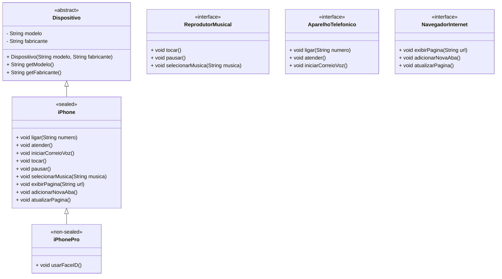

# Criação de um iPhone Utilizando os Conceitos de POO para o Bootcamp da Bradesco

## Sobre o Projeto

Este projeto foi desenvolvido para o Bootcamp da Bradesco, com o objetivo de aplicar os conceitos de Programação Orientada a Objetos (POO) de maneira prática e eficiente. A proposta foi criar um modelo de um iPhone, utilizando herança, interfaces, classe abstrata e polimorfismo para demonstrar como a POO pode ser aplicada para organizar e estruturar um sistema de forma inteligente.

A estrutura foi projetada com o intuito de refletir a funcionalidade de dispositivos móveis de forma simplificada, mas mantendo os princípios fundamentais da POO, como encapsulamento e reusabilidade de código. Utilizei o Mermaid para ilustrar a arquitetura das classes e como elas se relacionam.

Arquitetura do Sistema
O diagrama a seguir mostra a organização das classes e interfaces:



#                                    Funcionalidades Implementadas
## O iPhone possui várias funcionalidades que foram divididas em interfaces específicas para promover o uso adequado da POO:

- ReprodutorMusical: Responsável pela reprodução de músicas.
- AparelhoTelefonico: Responsável pelas funcionalidades de chamadas, como ligar, atender e iniciar correio de voz.
- NavegadorInternet: Responsável pela navegação na internet, com funções de exibição de páginas e gerenciamento de abas.
Além disso, temos a classe abstrata Dispositivo, que serve como base para as classes iPhone e iPhonePro.

Exemplo de Código
A seguir, um exemplo de implementação da classe iPhone, que demonstra como os conceitos de herança e implementação de interfaces são utilizados:

```java
public class iPhone extends Dispositivo implements ReprodutorMusical, AparelhoTelefonico, NavegadorInternet {

    public iPhone(String modelo, String fabricante) {
        super(modelo, fabricante);
    }

    @Override
    public void ligar(String numero) {
        System.out.println("Ligando para " + numero);
    }

    @Override
    public void atender() {
        System.out.println("Atendendo a chamada...");
    }

    @Override
    public void iniciarCorreioVoz() {
        System.out.println("Iniciando correio de voz...");
    }

    @Override
    public void tocar() {
        System.out.println("Tocando música...");
    }

    @Override
    public void pausar() {
        System.out.println("Pausando música...");
    }

    @Override
    public void selecionarMusica(String musica) {
        System.out.println("Selecionando música: " + musica);
    }

    @Override
    public void exibirPagina(String url) {
        System.out.println("Exibindo página: " + url);
    }

    @Override
    public void adicionarNovaAba() {
        System.out.println("Abrindo nova aba...");
    }

    @Override
    public void atualizarPagina() {
        System.out.println("Atualizando página...");
    }
}
```

# Agradecimentos

Gostaria de expressar minha profunda gratidão à DIO (Digital Innovation One) e ao Bradesco pela oportunidade de participar deste Bootcamp. A experiência foi extremamente enriquecedora e me proporcionou uma compreensão mais profunda dos conceitos de Programação Orientada a Objetos. Agradeço também pela chance de aprender com a prática e aplicar esses conhecimentos de forma eficaz.

Este projeto não seria possível sem o apoio de todos os envolvidos, e sou muito grato pela jornada de aprendizado proporcionada!
